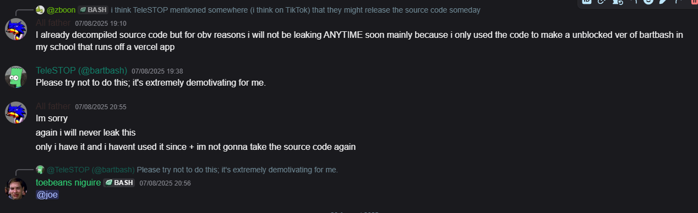

# This archive is no longer being maintained.

# Please please PLEASE go support teleSTOP!! Here is the original site:
## https://www.bartbash.com
## They are the original creators, only use the archive if you want to see the history of bart bash, or have an unblocked version on things like school wifi.

# This archive does not hold source code, this repository holds only the compiled files that anyone can get. I dont reccommend decompiling the code, as even the officials said not to do this.

Alternative mirror/archive of the new bart bash.\

Current hosted versions:\
N/A - 0.06\
26/08/2025 - 0.065

## ❄︎☟︎☜︎ ☹︎✋︎☠︎😐︎ ☟︎✌︎💧︎ 👌︎☜︎☜︎☠︎📬︎
## ☼︎☜︎👎︎✌︎👍︎❄︎☜︎👎︎📬︎
## ❄︎☟︎✋︎💧︎ ☝︎✌︎💣︎☜︎ ☟︎✌︎💧︎ 🏱︎☼︎⚐︎✞︎☜︎☠︎ ❄︎⚐︎ 👌︎☜︎
## ✞︎☜︎☼︎✡︎
## ✞︎☜︎☼︎✡︎
# ✋︎☠︎❄︎☜︎☼︎☜︎💧︎❄︎✋︎☠︎☝︎📬︎
